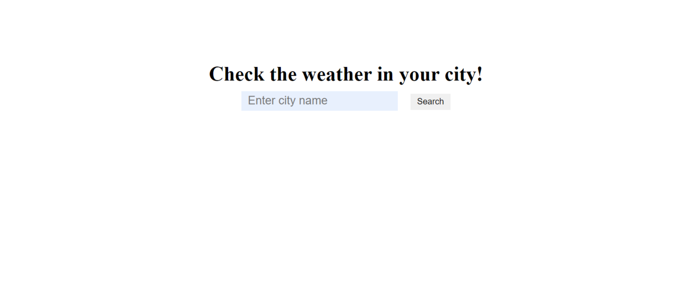
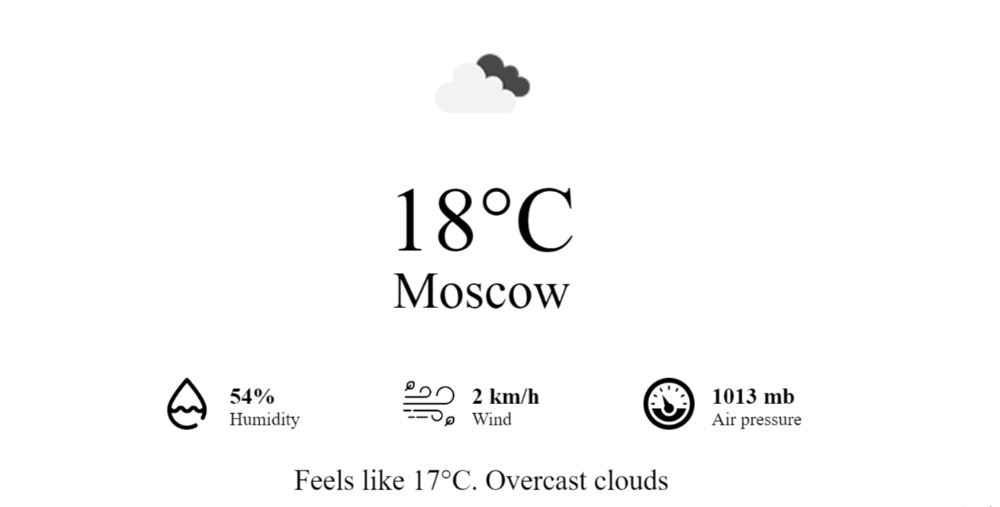

[](https://codeclimate.com/github/Nadezhda-97/weather-app/maintainability)

# Weather App
An application where you can find out the current weather in any city, region or country.

### Requirements
* Node.js (version 13.2.0 and higher)

### Install & Run
```
git clone git@github.com:Nadezhda-97/weather-app.git
```
```
cd weather-app
```
```
make install
```
```
make develop
```

### Demo
Search form:


Result:


You can try to use the app [here](https://weather-app-rose-ten-53.vercel.app/)
